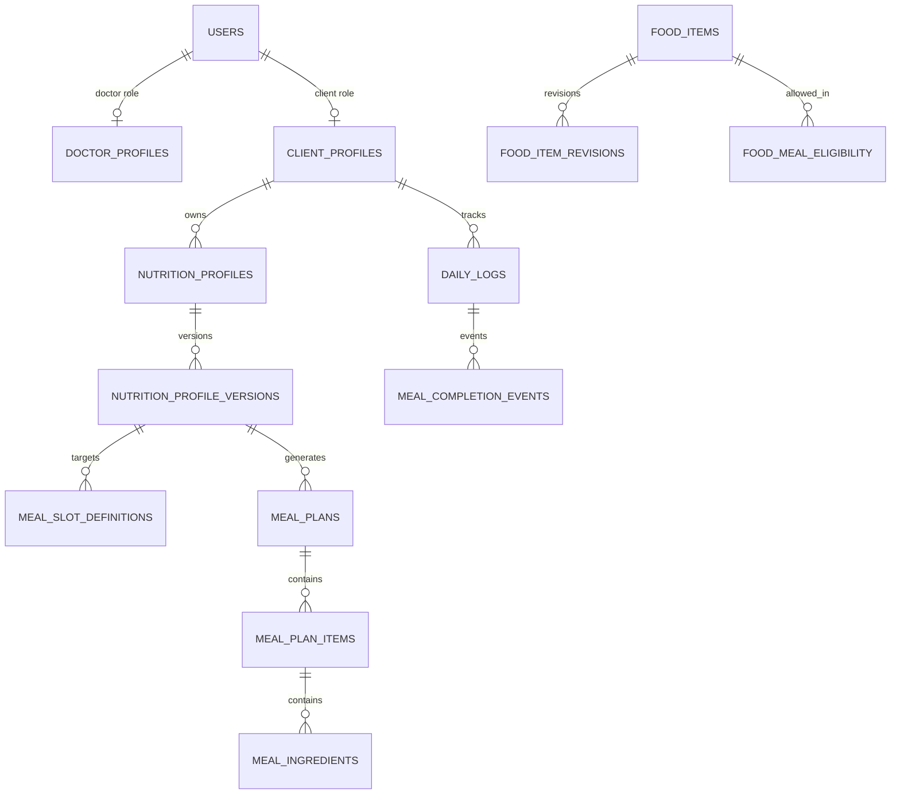

# HyperFit database schema

المصدر التنفيذي للسكيما هو [`schema.sql`](./schema.sql). التصميم يفصل حساب الدخول عن ملف الدور، ولا يخلط الطبيب والعميل في جدول واحد كبير.



## الأدوار

| الدور | ما يراه | ما يستطيع فعله |
|---|---|---|
| `CLIENT` | ملفه، خطته الفعالة، وجبات اليوم، تقدمه | إكمال وجبة وتحديث تفضيلاته المسموحة |
| `DOCTOR` | جميع العملاء وبياناتهم وخططهم | إضافة حساب عميل، الحساب، إنشاء الإصدارات، التوليد، المراجعة والاعتماد |
| `ADMIN` | جميع المستخدمين والعملاء والخطط والإعدادات | إضافة العملاء وإدارة المستخدمين والأطباء والأطعمة والقواعد والنظام |

العملاء مشتركون على مستوى النظام، لذلك لا توجد علاقة إسناد بين الطبيب والعميل: أي عميل يضيفه الطبيب أو الأدمن يظهر للطرفين مباشرة.

## أنواع الحقول المطلوبة

- `age`: ‏`integer` مع قيد من 18 إلى 100.
- `height_cm`: ‏`real` ومطلوب.
- `weight_kg`: ‏`real` ومطلوب.
- `body_fat_pct`: ‏`real` اختياري لدعم معادلة Katch-McArdle.
- كل إصدار خطة يحفظ نسخة من المدخلات حتى لا تتغير نتائجه عند تعديل ملف العميل لاحقًا.

## منع تكرار قيمة التعديل

الواجهة ترسل `adjustment_kcal` كقيمة موجبة يحددها الطبيب، من دون تعديل TDEE. الخادم وحده يحدد الإشارة ويضيفها مرة واحدة:

```text
LOSS     = TDEE - abs(adjustment_kcal)
GAIN     = TDEE + abs(adjustment_kcal)
MAINTAIN = TDEE
```

## حدود الوجبات

جدول `food_meal_eligibility` يحدد صراحة أين يمكن استخدام الطعام. مثال: البيض والزبادي للفطور، الدجاج والأرز للغداء، السمك والعدس للعشاء، والفواكه والمكسرات للسناك. المولد لا يختار طعامًا لا يملك سجل سماح لنوع الوجبة.

## دورة حياة الخطة

- يسمح لكل عميل بخطة `ACTIVE` واحدة ومسودة `DRAFT` واحدة في الوقت نفسه.
- حفظ المسودة أو العودة إليها لا يغير الخطة الفعالة، ولا يمكن تعديل الخطة الفعالة مباشرة.
- اعتماد المسودة عملية ذرّية: تتحول المسودة إلى `ACTIVE` وتستبدل الخطة الفعالة السابقة مباشرة.
- لا يحتفظ النظام بحالة أو سجلات تاريخية للخطط المستبدلة.
